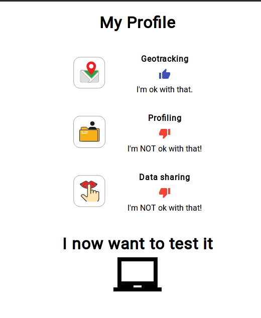
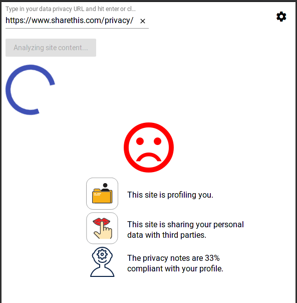
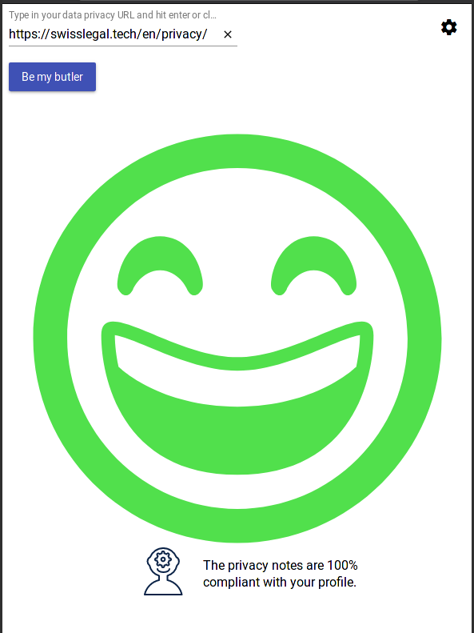

# Privacy Butler

_Many people like you and I feel that we are unable to cope with all the various privacy notices we have to deal with on a daily basis. Our data is important to us, and indeed defines our online identity. Your Privacy Butler will help you to understand any privacy notices. Simply tell Privacy Butler which data processing is a “no go” for you. It converts the privacy notice into icons that show you immediately whether your desired data protection standard is met or not._

[](https://github.com/SwissLegalTech)

This is a concept-stage project that was started at the [Swiss Legal Tech](http://swisslegal.tech) 2018 hackathon in Zürich, Switzerland. The original challenge idea can be [found here](SBB_Hackathon2018_PrivacyButler.pdf) (PDF).

## Demo

Currently our prototype has a minimal, functioning user interface. There is a basic welcome screen, followed by the configuration of tracking preferences:



Upon clicking the computer icon, a text field appears which accepts the URL of a privacy policy. If the result is not compliant with the user's preferences, the analysis is shown:



However, if the user's selections are matched by the algorithm, then simply a confirmation screen appears:



You can see a screencast of the [hackathon demo here](https://github.com/SwissLegalTech/privacy-butler/blob/master/the_pitch/privacy-butler-demo.gif).

# Development

Technical notes about our prototype solution:

### Backend

The backend uses Java with Spring Boot 2 and communicates with the Google Cloud Natural Language API.
You have to create the credentials yourself in order to be able to communicate with Google Cloud.

Find the backend project files here and instructions to get started in the [legal-hackathon-backend](./legal-hackathon-backend) folder.

### Frontend

The frontend uses Typescript with Angular 6 and Material Design as a styling framework addition to Angular.

You can find the frontend project files and build instructions in [legal-hackathon-frontend](./legal-hackathon-frontend).

### Splash

There is also a static HTML launch page defined in `index.html` with resources in the `web` folder. The design template used is [HTML5 UP](http://html5up.net), with [jQuery](https://jquery.org) and [FontAwesome](https://fontawesome.com).

In the markup of the HTML page we have a simple proposal on using schema in META tags to publish web site policy in machine readable form, e.g.:

```
<meta name="privacy:geotracking" value="no" />
<meta name="privacy:thirdparties" value="no" />
<meta name="privacy:profiling" value="no" />
```

More projects similar this can be found in our [reading list](#References) below.  

## Data

We used the **Google Cloud Natural Language API** in this project for rapid analysis of policy texts. See [Quickstart](https://cloud.google.com/natural-language/docs/quickstart), [NL Samples](https://cloud.google.com/natural-language/docs/samples), and [Java samples for Google Cloud Platform](https://github.com/GoogleCloudPlatform/java-docs-samples/tree/master/language/).

You will need to obtain a developer key from the Cloud API console to use our current backend.

We also ran a short machine learning classification experiment using an open dataset of opt-out policies from [usableprivacy.org](https://usableprivacy.org/data/) in the **[Keras.io](https://keras.io)** deep learning environment. The results can be seen in a [Python notebook](https://github.com/SwissLegalTech/privacy-butler/blob/master/ml/keras-test.ipynb) made with Jupyter, in the `ml` subfolder.

The dataset used in the experiment above was one of the ones recommended by [Pribot.org](https://pribot.org/), a project that was a major motivation for our work here. Many thanks to [Dr. Harkous](http://www.hamzaharkous.com/) for feedback to our concept during the hackathon.

We also considered using [IBM Watson](https://www.ibm.com/watson/services/natural-language-understanding/) (see [Fredrik Stenbeck comparison](http://fredrikstenbeck.com/google-natural-language-vs-watson-natural-language-understanding/) - and [OpenNLP at Apache](https://opennlp.apache.org/).

# References

Further reading, in no particular order.

#### Online policy tools

- [Pribot](https://pribot.org/) - an EPFL research project - visualizes and responds to questions about privacy policies.
- [Privacy Bot](https://cliqz-oss.github.io/privacy-bot/) gathers, persists and analyzes privacy policies - based on the [PrivacyGuide](https://github.com/cliqz-oss/privacy-bot/wiki/PrivacyGuard-Methodology) paper (2018, Tesfay et al).
- [Terms of Service; Didn't Read](https://tosdr.org/) crowdsources reviews of online policies.
- [Privacy Badger](https://www.eff.org/privacybadger) from EFF is a browser plugin that learns to block trackers, with an [policy compliance](https://www.eff.org/privacybadger/faq#-I-am-an-online-advertising-/-tracking-company.--How-do-I-stop-Privacy-Badger-from-blocking-me) mechanism.
- [PrivacyCheck](https://chrome.google.com/webstore/detail/privacycheck/poobeppenopkcbjejfjenbiepifcbclg?hl=en-US) is a Google Chrome browser plugin that automatically summarizes and visualizes online privacy policies.

#### Policy documentation

Additional documentation that could be useful to developers of policy tools:

- [Privacy Shield](https://www.privacyshield.gov/) lists companies that comply with data protection regulations, along with policy summaries.
- [A Domain Ontology For Online Privacy](http://www.semantic-web-journal.net/content/improving-readability-online-privacy-policies-through-doop-domain-ontology-online-privacy) is a research paper that suggests improvements to policy statements.
- [Data Privacy Vocabularies and Controls](https://www.w3.org/community/dpvcg/) is a new Community Group at the W3C, that aims to define a taxonomy of privacy terms.
- [Ontology for Data Privacy Policy](https://ebiquity.umbc.edu/resource/html/id/370/Ontology-for-Data-Privacy-Policy) proposes a definition for publishing privacy policies as Linked Data.
- [GDPRtEXT](https://openscience.adaptcentre.ie/projects/GDPRtEXT/) is a representation of the text of GDPR using Linked Data.
- [Open Badges](https://backpack.openbadges.org/backpack/welcome) are tools from Mozilla for online learning, which could in theory be adapted for privacy preferences.

#### Machine learning

A couple of introductory articles on relevant topics in Machine Learning:

- https://medium.com/datathings/the-magic-of-lstm-neural-networks-6775e8b540cd
- http://blog.echen.me/2017/05/30/exploring-lstms/
- https://github.com/ar-ms/lstm-mnist
